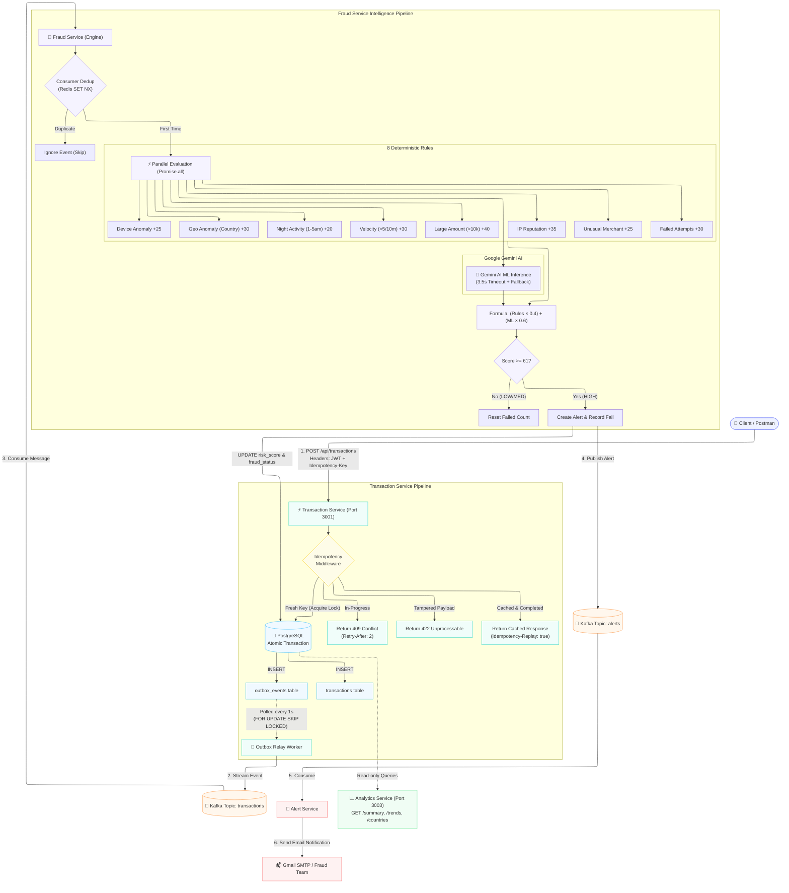

# Real-Time Fraud Detection Platform

A production-grade, event-driven fraud detection and transaction processing system built with TypeScript microservices. Detects fraudulent transactions in milliseconds using a combination of deterministic rule-based scoring, Redis-backed velocity & anomaly checks, and Google Gemini AI, featuring **Stripe/IETF-standard Idempotency**, the **Transactional Outbox Pattern**, and a **Dead Letter Queue (DLQ) Failure Recovery Pipeline**.

---

## What This Does

Every time a transaction comes in, the system:

1. **Guarantees Idempotency**: Inspects the `Idempotency-Key` header, verifies SHA-256 payload integrity, prevents duplicate processing, and replays cached responses instantly.
2. **Enforces Authentication & Safety**: Validates JWT bearer tokens and sanitizes request parameters.
3. **Transactional Outbox Persistence**: Atomically writes transactions and domain events into PostgreSQL in a single database transaction.
4. **Reliable Event Streaming**: Asynchronously relays events to Apache Kafka with zero lost messages even during broker outages.
5. **DLQ & Poison Message Isolation**: Automatically retries transient failures 3 times with incremental backoff; routes unrecoverable or malformed payloads to `transactions.dlq` without stalling Kafka partitions.
6. **Multi-Rule Evaluation**: Runs 8 fraud detection rules in parallel using Redis for velocity counters, device fingerprints, geolocation history, IP reputation, and merchant profiling.
7. **Gemini AI Risk Scoring**: Prompts Google Gemini ML for explainable fraud probability and reasoning (with 3.5s timeout & fallback).
8. **Combined Risk Engine**: Blends rule-based score (40%) and AI score (60%) into a final risk rating (LOW, MEDIUM, HIGH).
9. **Automated Alerting & Action**: Publishes high-risk alerts to Kafka, triggers automated email dispatch via Gmail SMTP, and supports analyst blocking workflows.
10. **Real-time Analytics**: Provides aggregations, 7-day fraud trends, and regional breakdown APIs for monitoring.

---

## System Architecture

```
CLIENT / POSTMAN
      │
      │ HTTP POST /api/transactions
      │ Headers: Authorization: Bearer <JWT>, Idempotency-Key: <UUID>
      ▼
┌─────────────────────────────────────────────────────────────────┐
│                     TRANSACTION SERVICE                         │  port 3001
│                     Node.js + TypeScript                        │
│                                                                 │
│   ├── JWT Auth & Schema Validation                              │
│   ├── Stripe/IETF Idempotency Middleware (SHA-256 Fingerprint)  │
│   ├── PostgreSQL (Atomic: transactions + outbox_events)         │
│   └── Background Outbox Relay Worker (Guaranteed Delivery)      │
└────────────────────────────────┬────────────────────────────────┘
                                 │
                                 │ publishes to topic: "transactions"
                                 ▼
┌─────────────────────────────────────────────────────────────────┐
│                        APACHE KAFKA                             │
│                                                                 │
│   topic: transactions      (Partitioned by transaction_id)      │
│   topic: transactions.dlq  (Dead Letter Queue for failures)     │
│   topic: alerts            (Carries HIGH-risk alerts)           │
└───────────────┬───────────────────────────────┬─────────────────┘
                │                               │
                │ consumed by fraud-service     │ unrecoverable failures
                ▼                               ▼
┌─────────────────────────────────────────────────────────────────┐
│                        FRAUD SERVICE                            │
│   ├── Consumer Deduplication (Redis SET NX)                     │
│   ├── 3-Attempt Retry Loop with Incremental Backoff             │
│   ├── DLQ Error Envelope Dispatch (transactions.dlq)            │
│   ├── 8 Parallel Deterministic Rules (Redis Cache)              │
│   └── Gemini 1.5 Flash AI (3.5s Timeout + Safe Fallback)        │
└───────────────┬─────────────────────────────────────────────────┘
                │
                │ if HIGH → publishes to topic: "alerts"
                ▼
┌──────────────────────────┐     ┌────────────────────────────────┐
│      ALERT SERVICE       │     │       ANALYTICS SERVICE        │  port 3003
│      Node.js + TS        │     │       Node.js + Express        │
│                          │     │                                │
│   consumes alerts topic  │     │  GET /api/analytics/summary    │
│   sends email via Gmail  │     │  GET /api/analytics/trends     │
│   nodemailer + SMTP      │     │  GET /api/analytics/countries  │
└──────────────────────────┘     └────────────────────────────────┘
```

---

## Dead Letter Queue (DLQ) & Failure Recovery

In high-throughput event streaming, poison messages (corrupted JSON, missing schemas, unexpected runtime exceptions) can crash consumers and block partition offsets indefinitely. 

To eliminate single-point-of-failure bottlenecks:

```
[Kafka Event: "transactions"] 
              │
              ▼
    [Consumer Worker] ──► Try Attempt 1 ──► (Fails)
              │
              ▼ Wait 200ms
    [Consumer Worker] ──► Try Attempt 2 ──► (Fails)
              │
              ▼ Wait 400ms
    [Consumer Worker] ──► Try Attempt 3 ──► (Fails)
              │
              ▼ (Exhausted Retries)
    [Route to DLQ] ──► Topic: "transactions.dlq"
              │
              ▼
   [Acknowledge Offset & Unblock Partition]
```

### DLQ Diagnostic Envelope Schema
Messages forwarded to `transactions.dlq` contain full diagnostic metadata:

```json
{
  "original_payload": "{\"bad_json\": ...}",
  "error_message": "malformed transaction: missing id or user_id",
  "error_stack": "Error: malformed transaction...\n    at ...",
  "retry_count": 3,
  "service": "fraud-service",
  "failed_at": "2026-09-01T06:55:00.000Z"
}
```

---
## Workflow of this project


## Enterprise Idempotency (Stripe & IETF RFC Standard)

Transactions are protected against network retries, double-clicks, and duplicate requests using an IETF RFC-compliant idempotency engine:

```
                  POST /api/transactions (with Idempotency-Key)
                                      │
                                      ▼
                        [ Idempotency Middleware ]
                                      │
                  ┌───────────────────┴───────────────────┐
                  ▼                                       ▼
          [Key Exists in DB?]                       [Key is Fresh]
                  │                                       │
        ┌─────────┴─────────┐                             ▼
     [Same Body Hash?]   [Different Body Hash?]    Acquire Lock: status='PROCESSING'
        │                           │                     │
   ┌────┴────┐                      ▼                     ▼
[COMPLETED] [PROCESSING]      Return 422             Execute Transaction Controller
   │            │             Unprocessable Entity        │
   ▼            ▼                                         ▼
Replay Cache   Return 409                         Save Response & Set COMPLETED
(Header:       Conflict / Retry-After
 Idempotency-
 Replay: true)
```

1. **Request Fingerprinting (SHA-256)**: Creates a deterministic hash of `METHOD:PATH:BODY`.
2. **Tamper Protection (`422 Unprocessable Entity`)**: Reusing an existing key with altered parameters (e.g. changing amount or user) is rejected immediately.
3. **Concurrency Lock (`409 Conflict`)**: Simultaneous requests with the same key receive `409 Conflict` with `Retry-After: 2`, preventing race conditions.
4. **Instant Response Replay (`Idempotency-Replay: true`)**: Replayed requests return in `< 20ms` directly from the cached response payload without hitting business logic or downstream Kafka.

---

## Transactional Outbox Pattern

To prevent distributed data inconsistencies where a database write succeeds but Kafka publishing fails:

1. The transaction record and the domain event are written to PostgreSQL inside a single atomic transaction:
   ```sql
   BEGIN;
   INSERT INTO transactions (...) VALUES (...);
   INSERT INTO outbox_events (aggregate_id, event_type, payload) VALUES (...);
   COMMIT;
   ```
2. The background **Outbox Relay** (`outboxRelay.ts`) continuously polls unpublished events with `FOR UPDATE SKIP LOCKED` (100ms interval), batches them to Kafka, and marks them `published_at = NOW()`.
3. Guarantees **At-Least-Once Delivery** with sub-second end-to-end pipeline latency (~0.9s).

---

## Fraud Detection Rules Explained

```
Rule 1 — Large Amount (+40 points)
  if transaction.amount > 10,000.

Rule 2 — Velocity (+30 points)
  if user makes > 5 transactions in 10 minutes (Redis atomic INCR + 10m TTL).

Rule 3 — Geo Anomaly (+30 points)
  if transaction country != user's last known country (Redis geo history).

Rule 4 — Device Anomaly (+25 points)
  if device_id has never been seen before for this user (Redis set).

Rule 5 — Night Activity (+20 points)
  if transaction occurs between 1:00 AM and 5:00 AM local time.

Rule 6 — IP Reputation (+35 points)
  if IP is hardcoded blacklisted or shared across > 10 distinct accounts.

Rule 7 — Multiple Failed Attempts (+30 points)
  if user has >= 5 consecutive high-risk / failed payment attempts.

Rule 8 — Unusual Merchant Category (+25 / +15 points)
  +25 for high-risk categories (crypto, gambling, adult, firearms)
  +15 if category is new for an established user profile.

Gemini AI Inference (Weighted at 60%)
  Sends transaction features and context to Google Gemini ML.
  Returns { fraud_probability: 0.87, reason: "High-value transfer from unrecognized device in unusual region" }.
  Final combined score: (Rule Score × 0.4) + (ML Score × 0.6)
```

---

## Risk Classification

```
Score 0  - 30   →   LOW       Normal legitimate transaction
Score 31 - 60   →   MEDIUM    Flagged for monitoring
Score 61 - 100  →   HIGH      Alert triggered, email sent to fraud team
Manual Block    →   BLOCKED   Transaction frozen by analyst
```

---

## Project Structure

```
fraud-platform/
├── docker-compose.yml              # PostgreSQL, Redis, Kafka, Zookeeper, Kafka UI
├── init.sql                        # Database bootstrap schemas
├── scripts/
│   └── simulate.ts                 # End-to-end live simulator script
│
└── services/
    ├── transaction-service/        # Ingestion API, Idempotency & Outbox Relay
    │   └── src/
    │       ├── index.ts            # Server entrypoint & DB initialization
    │       ├── db.ts               # PostgreSQL pool & schema migrations
    │       ├── kafka.ts            # Kafka producer configuration
    │       ├── outboxRelay.ts      # Transactional outbox background relay
    │       ├── types.ts            # Transaction, Alert, & Idempotency types
    │       ├── middleware/
    │       │   ├── authMiddleware.ts         # JWT bearer token verification
    │       │   └── idempotencyMiddleware.ts  # Stripe/IETF RFC Idempotency Engine
    │       ├── controller/
    │       │   ├── transaction.controller.ts # Transaction CRUD & Outbox logic
    │       │   └── block.controller.ts       # Analyst freeze/block actions
    │       └── routes/
    │           ├── transaction.routes.ts     # Protected transaction routes
    │           └── block.routes.ts           # Block/unblock endpoints
    │
    ├── fraud-service/              # Core Risk Engine & AI Inference
    │   └── src/
    │       ├── index.ts            # Kafka consumer orchestrator
    │       ├── kafka.ts            # Kafka consumer, DLQ producer & retry loop
    │       ├── redis.ts            # Redis connection & cache helpers
    │       ├── engine/
    │       │   └── fraudEngine.ts  # Runs 8 rules + AI score blending
    │       ├── rules/              # 8 deterministic fraud rules
    │       └── services/
    │           ├── geminiService.ts# Google Gemini AI integration (with timeout)
    │           └── alertService.ts # Postgres alert storage
    │
    ├── analytics-service/          # Read-only Analytics & Metrics
    │   └── src/
    │       ├── index.ts
    │       ├── controllers/analytics.controller.ts
    │       └── routes/analytics.routes.ts
    │
    └── alert-service/              # Notification & Email Dispatcher
        └── src/
            ├── index.ts            # Alert topic consumer
            └── services/
                ├── emailService.ts # Nodemailer SMTP dispatch (with retry)
                └── alertHandler.ts # Alert formatting & sending
```

---

## Getting Started

### 1. Start Infrastructure (Docker)
```bash
docker-compose up -d
```

### 2. Run All Services

```bash
# Terminal 1 — Transaction Service
cd services/transaction-service && npm run dev

# Terminal 2 — Fraud Service
cd services/fraud-service && npm run dev

# Terminal 3 — Analytics Service
cd services/analytics-service && npm run dev

# Terminal 4 — Alert Service
cd services/alert-service && npm run dev
```

### 3. Run Automated Tests
```bash
npm run test:all
```

### 4. Run Live Simulator
```bash
npm run simulate
```

---

## What Makes This Production-Grade

* **Dead Letter Queue (DLQ) & Isolation**: 3-attempt backoff with unrecoverable poison payload routing to `transactions.dlq`.
* **Enterprise Idempotency Engine**: Full compliance with Stripe and IETF Draft specs preventing duplicate billing and race conditions.
* **Transactional Outbox Pattern**: Zero-loss event streaming with decoupled asynchronous Kafka publishing.
* **Dual-Layer Intelligence**: 8 deterministic microsecond Redis rules fused with Google Gemini ML explainable reasoning.
* **Sub-Second Detection Latency**: Real-time Kafka stream processing with parallelized rule execution (`Promise.all`) in ~0.9s.
* **Resilient Failure Handling**: Graceful degradation (AI fallback to rules, outbox retry on broker outages, isolated alert dispatch).
* **Strict Type Safety**: Unified TypeScript interfaces and automated Jest test suites (56 tests) across all services.